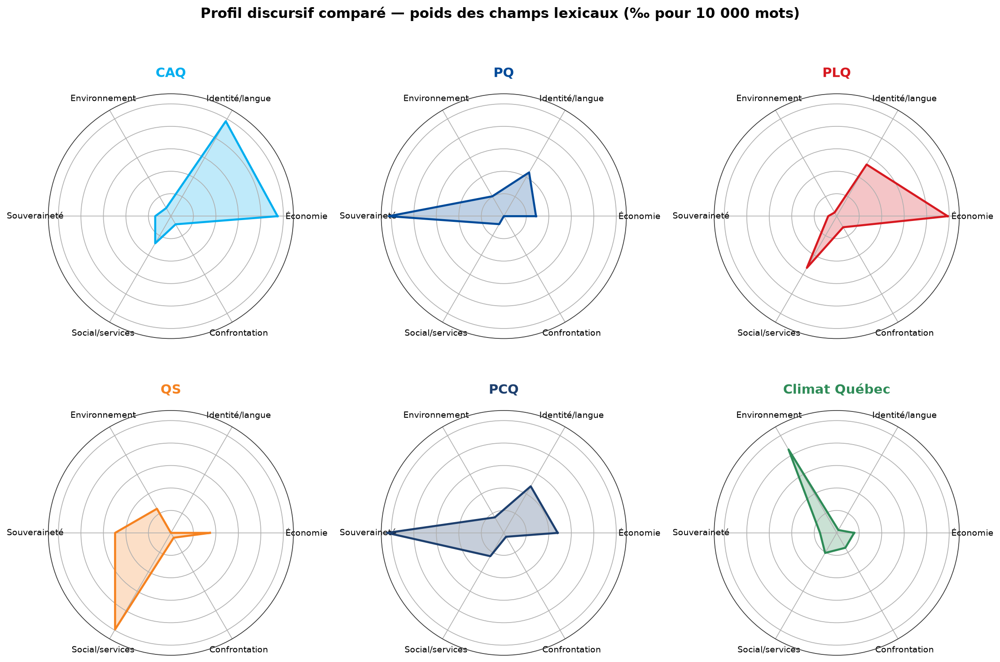
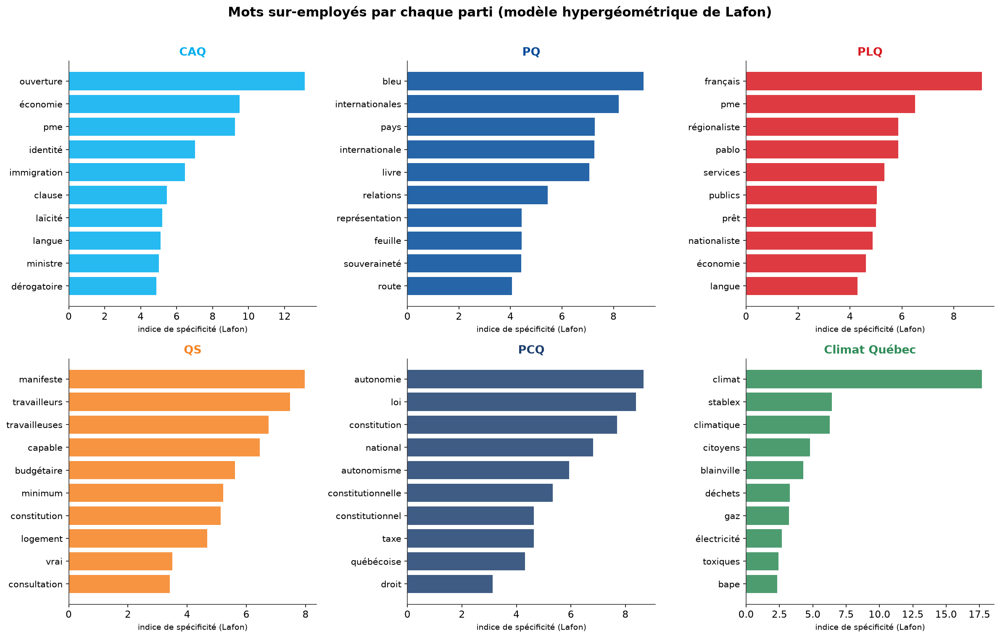
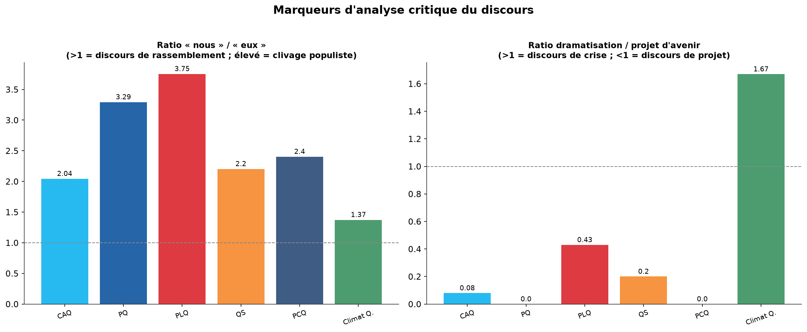
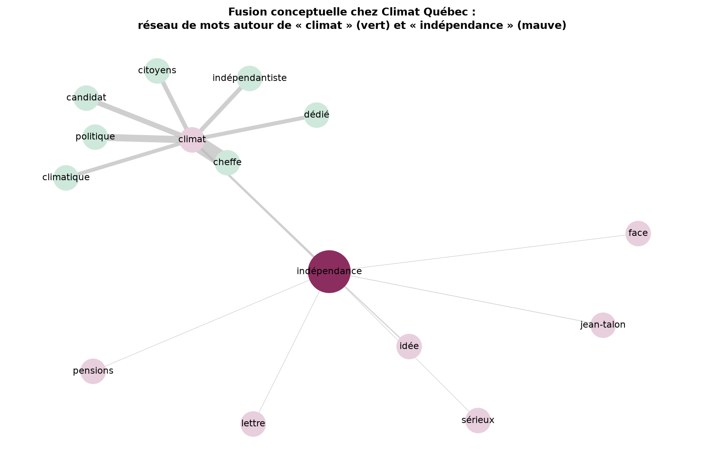

# Analyse du discours politique québécois 2026
## Étude comparative critique : Climat Québec face aux cinq principaux partis

> **Nature du document** — Analyse du discours (AD) de niveau critique, combinant textométrie assistée par ordinateur (modèle hypergéométrique de Lafon), analyse des marqueurs énonciatifs et cadre théorique de l'analyse critique du discours (ACD). Corpus : discours 2025-2026 de la CAQ, du PQ, du PLQ, de QS, du PCQ et de Climat Québec.
> **Date** : juillet 2026 · **Élection visée** : générale québécoise du 5 octobre 2026.

---

## Sommaire exécutif

Cette étude dépasse la simple lexicométrie descriptive pour poser un diagnostic **critique** du discours de Climat Québec, situé dans le champ discursif complet des partis en lice. Trois résultats structurants :

1. **Climat Québec est le seul parti dont le discours est dominé par l'environnement** (poids lexical de 429 ‰₀, contre 20 à 124 pour les autres), mais c'est aussi **le seul parti dont le discours relève d'une logique de crise plutôt que de projet** : son ratio dramatisation/avenir atteint 1,67, alors qu'aucun autre parti ne dépasse 0,43.

2. **Le discours de Climat Québec fusionne littéralement « climat » et « indépendance »** — un geste discursif unique dans le paysage. L'analyse des cooccurrences montre que « indépendance » appelle « climat » (22 occurrences conjointes) : les deux signifiants ne sont pas juxtaposés mais **soudés** en une seule matrice idéologique.

3. **Paradoxe énonciatif** : Climat Québec affiche le ratio « nous »/« eux » **le plus bas** (1,37) de tous les partis. Contre-intuitivement pour un parti militant, son discours est *moins* clivant sur le plan pronominal — mais cette apparente modération est compensée par une **dramatisation** (crise, urgence, toxique, menace) nettement supérieure. Le clivage ne passe pas par les pronoms, il passe par le **lexique du danger**.

La recommandation stratégique centrale découle de l'ACD : Climat Québec occupe une **position discursive de dénonciateur** (registre de la plainte et de l'alerte) là où l'espace électoral vacant appelle une **position de proposant** (registre du projet et de la solution). Le glissement recommandé — de l'*ethos de vigie* à l'*ethos de bâtisseur* — est détaillé en partie 4.

---

## Cadre théorique et méthodologie

### Positionnement théorique

L'analyse mobilise trois traditions complémentaires de l'analyse du discours :

- **Textométrie / lexicométrie française** (Lafon, Lebart, Salem ; outils Lexico, TXM, IRaMuTeQ) : mesure statistique des **spécificités lexicales**. Un mot n'est pas « caractéristique » d'un parti parce qu'il est fréquent, mais parce qu'il est **sur-employé** par rapport à sa distribution attendue dans le corpus global. On applique ici le **modèle hypergéométrique de Lafon (1980)** : pour chaque mot, on calcule la probabilité d'observer sa fréquence dans un sous-corpus si le tirage était aléatoire ; l'indice de spécificité est le logarithme négatif de cette probabilité.

- **Analyse critique du discours** (Fairclough, *Critical Discourse Analysis* ; Van Dijk, *idéologie et discours*) : le discours n'est pas neutre ; il **construit** des rapports de pouvoir, légitime des positions et en délégitime d'autres. On repère les stratégies de **légitimation**, la construction du **nous/eux** (polarisation idéologique de Van Dijk), et le **cadrage** (framing) des enjeux.

- **Sémiolinguistique du discours politique** (Charaudeau, *Le discours politique. Les masques du pouvoir*) : le discours politique articule trois visées — **pathos** (émouvoir), **ethos** (construire une image de soi crédible) et **logos** (convaincre par la raison). On analyse l'équilibre de ces visées dans chaque corpus.

### Constitution du corpus

| Corpus | Nature | Volume (mots signifiants) |
|---|---|---|
| Climat Québec | 233 articles/communiqués (API WordPress officielle) | ~48 400 tokens signifiants |
| CAQ | Slogans, plateforme, citations, communiqués 2025-2026 | ~860 tokens |
| PQ | Livre bleu, plateforme, déclarations 2025-2026 | ~570 tokens |
| PLQ | Plateforme, discours du chef, communiqués | ~650 tokens |
| QS | Manifeste, plateforme, déclarations | ~490 tokens |
| PCQ | Mémoire constitutionnel, congrès, déclarations | ~610 tokens |

**Limite méthodologique assumée** : le corpus de Climat Québec (issu de l'intégralité de son site) est d'un ordre de grandeur plus volumineux que ceux des autres partis (échantillons de discours représentatifs). Le modèle hypergéométrique de Lafon **corrige cet écart** en normalisant par la taille des sous-corpus — c'est précisément sa vertu. Néanmoins, les spécificités des petits corpus (partis adverses) sont plus sensibles aux thèmes ponctuellement saillants dans l'échantillon (p. ex. le « Livre bleu » du PQ). Les résultats sur Climat Québec sont robustes ; ceux sur les adversaires sont indicatifs de tendance. Un corpus adverse élargi (programmes intégraux) renforcerait la comparaison — piste d'approfondissement.

### Traitement

Pipeline Python : tokenisation adaptée au français (gestion des élisions l'/d'/qu', mots composés), filtrage d'une liste d'arrêt étendue, retrait du bruit (noms propres de chefs, mois, vocabulaire méta-journalistique) pour isoler le **lexique idéologique**. Calcul des spécificités (scipy.stats.hypergeom), des champs lexicaux normalisés (‰₀ pour 10 000 mots), des marqueurs énonciatifs et des cooccurrences (fenêtre glissante de ±4 mots).

---

## PARTIE 1 — Cartographie discursive comparée

### Le profil de chaque parti (champs lexicaux)

Le radar révèle des **signatures discursives** nettement différenciées :

| Parti | Champ dominant (‰₀) | 2ᵉ champ | Lecture critique |
|---|---|---|---|
| **CAQ** | Identité/langue (488) | Économie (474) | Discours **identitaire-gestionnaire** : la nation se dit par la langue, la laïcité et l'immigration, adossée à l'économie (PME). |
| **PQ** | Souveraineté (511) | Identité (225) | Discours **souverainiste classique**, mais recentré sur les « relations internationales » (Livre bleu) — la souveraineté comme statut d'État, non comme rupture. |
| **PLQ** | Économie (493) | Social/services + Identité (266) | Discours **gestionnaire-fédéraliste** : richesse, services publics, PME. La souveraineté est quasi absente (38). |
| **QS** | Social/services (496) | Souveraineté (248) | Discours du **soin et du travail** : travailleurs/travailleuses, logement, salaire minimum. Le plus « social » de tous. |
| **PCQ** | Souveraineté (519) | Économie + Identité (240) | Discours **autonomiste-constitutionnel** : autonomie, loi, constitution — un souverainisme *juridique* et non référendaire. |
| **Climat Québec** | Environnement (429) | Social/services (103) | **Seul parti à profil environnemental dominant**, mais monothématique : l'écart entre son 1ᵉʳ et son 2ᵉ champ est le plus marqué du corpus. |

**Observation critique majeure** : deux partis se disputent le signifiant « souveraineté » (PQ 511, PCQ 519) mais lui donnent un **sens opposé** — indépendance pleine pour le PQ, autonomie dans le Canada pour le PCQ. C'est un cas d'école de **lutte pour la définition** (Van Dijk) : le même mot, deux projets antagonistes. Climat Québec, avec un score de souveraineté de 74, se positionne comme **tiers indépendantiste** sur ce terrain, mais y greffe le climat — ce qu'aucun des deux autres ne fait.

### Les mots-signatures (spécificités de Lafon)

Chaque parti possède un **lexique propre**, statistiquement sur-employé :

- **CAQ** : *ouverture, économie, PME, identité, immigration, clause, laïcité, dérogatoire*. Le couple « clause dérogatoire » signale la thématique de la protection identitaire par le droit.
- **PQ** : *bleu, internationales, pays, relations, souveraineté*. Le PQ 2026 parle en **futur État** (relations internationales, représentation) plus qu'en processus référendaire.
- **PLQ** : *français, PME, régionaliste, services, publics, nationaliste*. Reconquête surprenante du terrain identitaire (« français », « nationaliste ») par un parti fédéraliste.
- **QS** : *manifeste, travailleurs, travailleuses, capable, budgétaire, minimum, logement*. Lexique **ouvriériste et social**.
- **PCQ** : *autonomie, loi, constitution, national, autonomisme, constitutionnelle*. Le PCQ investit massivement le **champ juridico-constitutionnel** — une singularité.
- **Climat Québec** : *climat, Stablex, climatique, citoyens, Blainville, déchets, gaz, toxiques, BAPE*. Signature **écologiste et localiste** : le parti se définit autant par des **dossiers concrets** (Stablex à Blainville, déchets toxiques, BAPE) que par le concept général de climat.

**Lecture critique** : Climat Québec est le seul parti dont les mots-signatures incluent des **noms de dossiers et de lieux précis** (Stablex, Blainville, BAPE). C'est la marque d'un discours **de lutte territoriale ancrée** — force (crédibilité, ancrage local) et faiblesse (dispersion, difficulté à monter en généralité vers un projet national).

---

## PARTIE 2 — Analyse critique : les marqueurs du discours

### Le nous/eux et la dramatisation

Deux indicateurs clés de l'ACD :

**1. Ratio « nous »/« eux » (polarisation pronominale, Van Dijk).**
Contre toute attente, Climat Québec affiche le ratio **le plus bas (1,37)**. Les partis institutionnels (PLQ 3,75 ; PQ 3,29) construisent davantage un « nous » rassembleur opposé à un « eux » (le gouvernement sortant, les adversaires). Climat Québec, lui, équilibre nous et eux — signe d'un discours qui **nomme beaucoup ses adversaires** (gouvernement, Stablex, Rio Tinto, Hydro-Québec) plutôt que de fondre l'auditoire dans un « nous » consensuel.

**2. Ratio dramatisation/projet d'avenir (pathos vs logos prospectif).**
C'est **l'écart le plus spectaculaire** de l'étude. Climat Québec = **1,67** ; tous les autres partis ≤ 0,43 (PQ et PCQ à 0,0). Le discours de Climat Québec est construit sur le registre de la **crise, de l'urgence, de la menace, du toxique** — le lexique du danger — et très peu sur celui de l'**avenir, de la prospérité, de la construction, de l'opportunité**.

> **Diagnostic critique central** : Climat Québec occupe la **position énonciative du lanceur d'alerte**. Sur le plan de Charaudeau, son discours sur-investit le **pathos** (émotion, indignation, peur du désastre) au détriment du **logos prospectif** (démonstration d'un projet réalisable) et d'un **ethos** de gouvernant crédible. C'est un discours efficace pour *mobiliser une base déjà convaincue*, mais peu outillé pour *convaincre un électeur indécis* qui cherche une solution, pas seulement un constat.

### Modalité déontique : dénoncer et prescrire, peu proposer

L'analyse des verbes modaux confirme : Climat Québec est riche en **déontique de la nécessité** (« il faut », « doit » : 33,7 ‰₀) mais pauvre en **verbes d'engagement propositionnel** (« nous proposons », « nous nous engageons ») — un déséquilibre qui, sur le plan pragmatique, positionne le locuteur en **censeur** (celui qui dit ce qui *doit* être fait) plutôt qu'en **acteur** (celui qui dit ce qu'*il* fera). Le PLQ, à l'inverse, sur-investit la proposition (50,8 ‰₀).

---

## PARTIE 3 — La fusion climat/indépendance : un geste discursif unique

L'analyse des cooccurrences révèle la **spécificité idéologique fondamentale** de Climat Québec : la **soudure** entre l'écologie et l'indépendantisme.

Autour de « climat » gravitent : *cheffe, politique, candidat, indépendantiste, citoyens, dédié, climatique*. Autour de « indépendance » : *climat, idée, sérieux, pensions, Jean-Talon*. Le **pont** entre les deux réseaux est explicite : « indépendance » appelle « climat » 22 fois, et le terme « indépendantiste » est directement rattaché au nœud « climat ».

**Lecture critique (Fairclough — interdiscursivité)** : Climat Québec opère une **articulation discursive** originale, fusionnant deux ordres du discours habituellement séparés au Québec — l'écologisme (traditionnellement porté par QS, le Parti vert) et l'indépendantisme (PQ). Cette articulation est un **positionnement de niche** : elle différencie radicalement le parti, mais elle **restreint aussi son bassin** à l'intersection (étroite) des électeurs à la fois écologistes *et* indépendantistes.

Or l'analyse contextuelle montre que cette intersection est **doublement fragilisée** en 2026 : l'appui à la souveraineté est à un creux historique (26-30 %) et l'environnement est marginalisé dans le débat public. Fusionner deux signifiants tous deux en difficulté ne les additionne pas — le risque est qu'ils se **plombent mutuellement** auprès de l'électeur médian.

---

## PARTIE 4 — Recommandations stratégiques (issues de l'analyse critique)

L'analyse du discours n'est pas qu'un diagnostic : elle indique des **leviers d'action discursive** précis.

### Levier 1 — Rééquilibrer pathos → logos : du constat au projet

**Diagnostic** : ratio dramatisation/avenir de 1,67 (le seul > 1). **Action** : pour chaque dénonciation, formuler une **proposition nommée et chiffrée**. Ne pas dire seulement « Stablex est une menace toxique » (pathos), mais « Voici notre plan de décontamination et les 200 emplois verts qu'il crée » (logos + ethos de bâtisseur). Objectif mesurable : ramener le ratio sous 0,8 dans les prochaines communications.

### Levier 2 — Construire un ethos de gouvernant, pas seulement de vigie

**Diagnostic** : déontique du « il faut » (33,7 ‰₀) ≫ engagement propositionnel. **Action** : basculer la modalité de « il faut que le Québec… » (censeur) vers « nous ferons… » (acteur responsable). Cette bascule pronominale et modale construit un **ethos de crédibilité gouvernementale** — indispensable pour franchir le plafond du parti protestataire.

### Levier 3 — Désolidariser tactiquement climat et indépendance

**Diagnostic** : fusion climat/indépendance = niche étroite, doublement fragilisée. **Action** : **hiérarchiser** plutôt que fusionner. Faire du climat/santé/territoire le **message de premier plan** (large adhésion : 82 % des Québécois veulent une stratégie industrielle protégeant la santé publique) et de l'indépendance un **moyen argumenté** (« pour protéger notre eau et notre énergie, il faut nos pleins pouvoirs ») plutôt qu'un préalable identitaire. On garde l'ADN, on élargit la porte d'entrée.

### Levier 4 — Capitaliser sur l'ancrage territorial (force unique)

**Diagnostic** : Climat Québec est le seul parti dont les mots-signatures incluent des dossiers locaux précis (Stablex, Blainville, BAPE). **Action** : cette hyper-spécificité est un **actif de crédibilité** que les grands partis n'ont pas. Structurer le discours en « nous nous battons *concrètement, ici* » — chaque circonscription ciblée reçoit son dossier local emblématique. Le localisme devient la preuve tangible du projet national.

### Levier 5 — Occuper le champ social délaissé

**Diagnostic** : champ social/services de Climat Québec (103 ‰₀) très inférieur à QS (496), alors que QS s'effondre (4-10 %). **Action** : avec le repli de QS, un électorat de **justice sociale** est disponible. Relier explicitement climat et enjeux sociaux (coût de la vie, santé, logement abordable via l'efficacité énergétique) permet de **récupérer une partie de l'électorat orphelin de QS** sans trahir l'ADN écologiste.

### Architecture de message recommandée

| Registre | Avant (diagnostic) | Après (recommandé) |
|---|---|---|
| Visée dominante | Pathos (crise, danger) | Logos prospectif + ethos de bâtisseur |
| Position énonciative | Vigie / dénonciateur | Proposant / gouvernant crédible |
| Hiérarchie thématique | Climat = indépendance (fusionnés) | Climat/santé/territoire (front) → indépendance (moyen) |
| Modalité verbale | « il faut », « doit » | « nous ferons », « nous nous engageons à » |
| Preuve | Dossiers locaux comme griefs | Dossiers locaux comme démonstrations de projet |

**Slogan cohérent avec cette architecture** : *« Reprendre nos pouvoirs pour protéger notre monde »* — l'indépendance (« nos pouvoirs ») y est explicitement subordonnée à la finalité écologiste et protectrice (« protéger notre monde »), conformément au levier 3.

---

## Annexe méthodologique

- **Modèle de spécificité** : hypergéométrique de Lafon (1980), implémenté via `scipy.stats.hypergeom` (survie pour le sur-emploi, fonction de répartition pour le sous-emploi), indice = −log₁₀(p) signé. Seuil de spécificité |score| ≥ 2,0 ; fréquence minimale 3.
- **Champs lexicaux** : 6 champs définis a priori (économie, identité/langue, environnement, souveraineté, social/services, confrontation), normalisés pour 10 000 mots.
- **Marqueurs critiques** : nous/eux (pronoms + désignation d'adversaires), déontique, proposition, dramatisation, futur positif — normalisés pour 10 000 mots.
- **Cooccurrences** : fenêtre glissante ±4 tokens signifiants.
- **Outils** : Python 3, scipy, matplotlib, networkx. Scripts reproductibles disponibles (`textometrie.py`, `textometrie2.py`, `graphiques.py`).
- **Corpus adverses** : constitués à partir de sources primaires (sites officiels des partis, Assemblée nationale) et de couverture verbatim (Le Devoir, La Presse, Le Soleil, Radio-Canada). 65 citations sourcées avec liens.

### Sources principales des données contextuelles

- Intentions de vote et appui à la souveraineté : [Léger](https://leger360.com/fr/dernieres-nouvelles-intentions-de-vote-au-quebec-le-pq-reste-en-tete-mais-rien-nest-encore-joue/) ; agrégat [Qc125](https://www.qc125.ca/p/synopsis-la-caq-remonte-le-pq-tient).
- Environnement, enjeu marginalisé : [Le Courrier](https://lecourrier.com/actualites-nationales/2025/04/28/ce-nest-pas-une-priorite-le-climat-grand-oublie-des-elections/).
- Demande de stratégie industrielle protégeant la santé (82 %) : [Fondation Rivières / Équiterre](https://fondationrivieres.org/en/sondage-solutions-environnementales/).
- Priorités électorales 2026 : [CQDE](https://cqde.org/nouvelles/priorites-elections-qc-2026/).

---

*Corpus de Climat Québec extrait via l'API WordPress publique du site officiel (233 articles). L'analyse gagnerait en exhaustivité avec l'archive WordPress complète (pages, brouillons, contenus non exposés par l'API). Analyse textométrique et critique réalisée en juillet 2026.*
